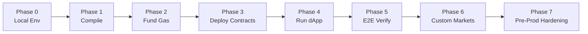

# Роадмап деплою — Prediction Market на Arc Testnet

Чіткий фазовий роадмап від локального середовища до робочого dApp на Arc Testnet і далі.
Кожна фаза має **мету**, **кроки**, **контрольну точку (gate)** і **rollback**. Поточний статус
позначено: ✅ зроблено · ⏳ наступне · 🔜 опційно/pre-prod.

---

## Phase 0 — Локальне середовище ✅

- **Мета:** робочий клон і залежності в `C:\arc predict Edge`.
- **Кроки:** `git clone` → `npm install`.
- **Gate:** `added 2197 packages`, exit 0. ✅
- **Rollback:** видалити `node_modules`, `npm cache clean --force`, повтор.

## Phase 1 — Компіляція контрактів ✅

- **Мета:** артефакти контрактів і typings.
- **Кроки:** `npm run compile`.
- **Gate:** `Compiled 23 Solidity files successfully`, `86 typings`. ✅
- **Rollback:** `npx hardhat clean` → повтор compile.

## Phase 2 — Поповнення газу ✅

- **Мета:** деплоєр має нативний USDC на газ.
- **Кроки:** заповнити `.env.local` (`PRIVATE_KEY`, RPC); запросити USDC з
  [Circle faucet](https://faucet.circle.com/) на адресу деплоєра.
- **Gate:** баланс деплоєра > 0 на [Arcscan](https://testnet.arcscan.app). ✅ (поповнено до 20 USDC)
- **Rollback:** повторний запит з faucet; перевірити правильність мережі/адреси.
- **⚠️ Чек безпеки:** ключ — некастодіальний тестнет-EOA; `.env.local` НЕ в git. ✅
- **Урок:** перша спроба з 0.13 USDC впала на півдорозі — повний деплой коштує ~0.39 USDC; тримайте буфер.

## Phase 3 — Деплой контрактів ✅

- **Мета:** UMA-стек + market + AMM у Arc Testnet, адреси в `.env.local`.
- **Кроки:** `npm run deploy` (7 фаз скрипта; див. [deployment-plan.md](deployment-plan.md) §5).
- **Gate:** `=== Deployment Summary ===` з усіма адресами; `.env.local` дописано. ✅
  Адреси зафіксовано в [deployed-addresses.md](deployed-addresses.md).
- **Rollback:** деплой ідемпотентний на рівні нового набору контрактів — повторний `npm run deploy`
  деплоїть свіжий стек і перезапише адреси. Старі контракти лишаються на чейні (тестнет — безкоштовно).
- **Типові збої:** «no balance» → Phase 2; «stuck pending» → скрипт сам чистить nonce; BAD_DATA на
  view-викликах → вбудований `retryCall` (RPC-затримка).

## Phase 4 — Запуск dApp ✅

- **Мета:** dev-сервер віддає UI з живими даними.
- **Кроки:** `npm run dev` → http://localhost:3000.
- **Gate:** `Ready`, `GET / 200`, `GET /market/… 200`. ✅ (з реальними адресами)
- **Verify:** `node --experimental-strip-types scripts/verify-deploy.ts` → AMM 1000/1000, ціни 0.5/0.5.
- **Rollback:** зупинити процес; перевірити порт 3000; `rm -rf .next` → повтор.

## Phase 5 — E2E-перевірка ⏳

- **Мета:** повний життєвий цикл працює на тестнеті.
- **Кроки (у браузері):** Connect → Faucet (mint ARCT) → Approve → Buy/Sell (AMM) →
  Resolve (propose → liveness 60s → settle) → Redeem.
- **Gate:** усі 6 кроків проходять; події видно в Arcscan; баланси змінюються коректно.
- **Rollback:** для нового циклу — `npm run deploy` (свіжий ринок).

## Phase 6 — Кастомні ринки ⏳

- **Мета:** створення ринків з UI.
- **Кроки:** «Create Market» → YES/NO питання → `/api/create-market` деплоїть пару + seed 1000 ARCT.
- **Gate:** новий ринок у гріді, торгований; запис у `data/markets.json`.
- **Rollback:** `npm run reset` — прибирає користувацькі ринки (BTC-ринок не чіпає).
- **⚠️ Чек безпеки:** ендпойнт використовує серверний `PRIVATE_KEY` — не виставляти публічно без захисту.

## Phase 7 — Hardening перед production 🔜 (поза тестнетом)

Перелік із [ADR-001](ADR-001-architecture.md) Action Items 7–10 та
[risks-and-security.md](risks-and-security.md):

1. 🔜 Замінити `MockOracleAncillary` на реальний UMA DVM / офіційний OO-деплой; realistic `liveness`.
2. 🔜 Замінити mintable ARCT на реальний колатераль; прибрати вільний `allocateTo`.
3. 🔜 Захистити `/api/create-market` (auth + rate-limit) або перейти на клієнтський деплой.
4. 🔜 Додати slippage-protection (`minOut` + deadline) в AMM.
5. 🔜 Ключі деплоєра → KMS/HSM або mnemonic/HD-derivation.
6. 🔜 Юніт/інтеграційні тести lifecycle і AMM-інваріантів (`npm run test:contracts`).
7. 🔜 Зовнішній аудит контрактів перед мейннетом.

---

## Зведена таблиця контрольних точок

| Phase | Gate-критерій | Команда перевірки |
|---|---|---|
| 0 | 2197 packages, exit 0 | `npm install` |
| 1 | 23 файли скомпільовано | `npm run compile` |
| 2 | balance > 0 | Arcscan / faucet |
| 3 | Summary + `.env.local` адреси | `npm run deploy` |
| 4 | `GET / 200` | `npm run dev` |
| 5 | повний lifecycle | браузер + Arcscan |
| 6 | ринок у гріді | UI «Create Market» |
| 7 | pre-prod чеклист | ADR Action Items |

> **DoD виконано (тестнет, локально):** проєкт збирається, контракти компілюються, dev-сервер
> піднімається без помилок; ADR + діаграма + карта контрактів + план деплою + ризики готові.
> Залишок (Phase 2/3/5/6) вимагає приватного ключа деплоєра й газу — виконується оператором за
> цим роадмапом «з нуля».
</content>
