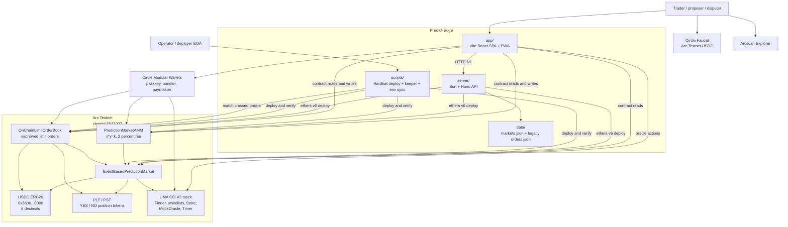
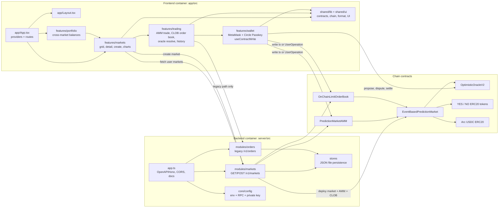
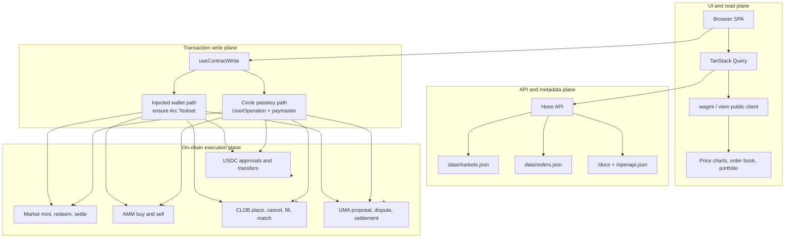
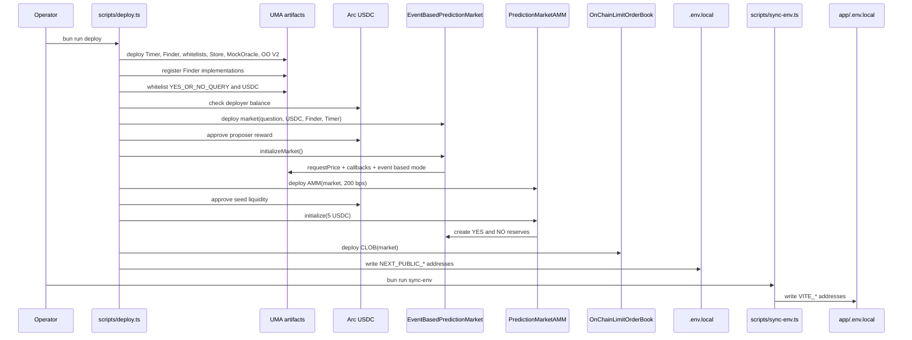
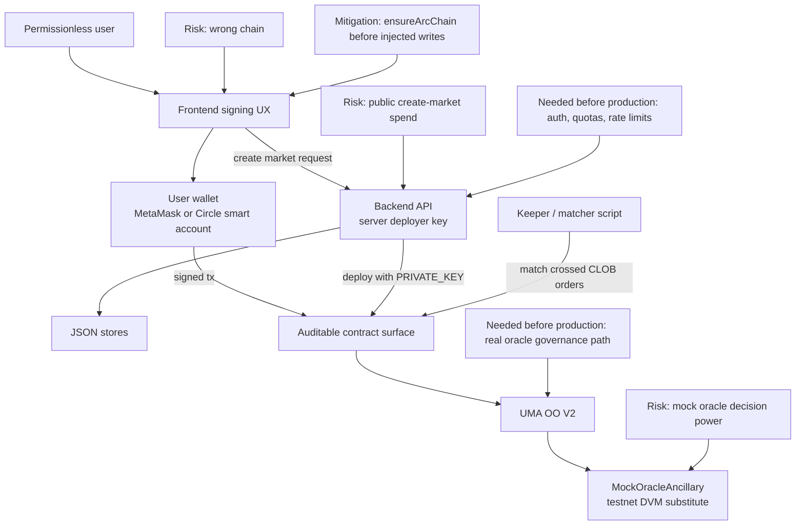

# Predict-Edge Architecture - Mermaid ASCII

All diagram labels in this file are ASCII-only.

## System Context

## Container And Module Map

## Runtime Data Planes

## Deployment Architecture

## Trust Boundaries

