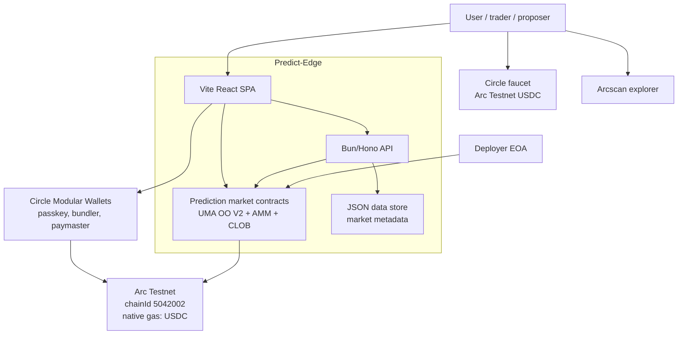
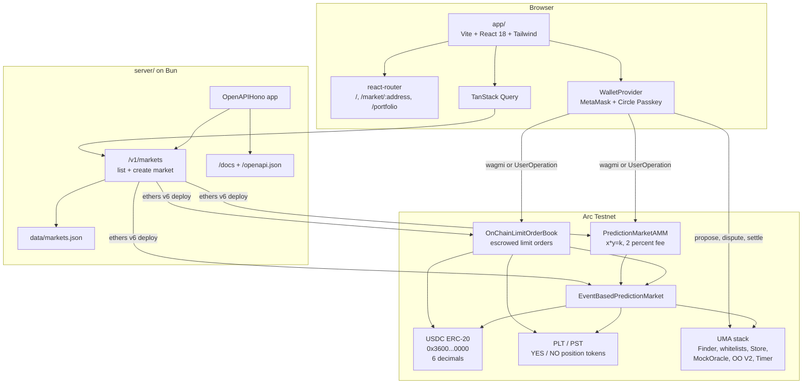
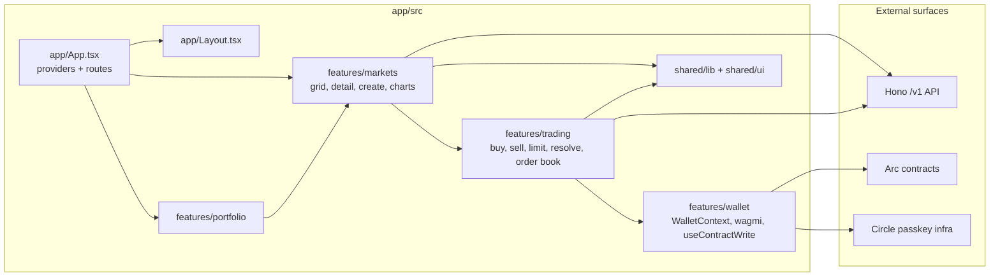
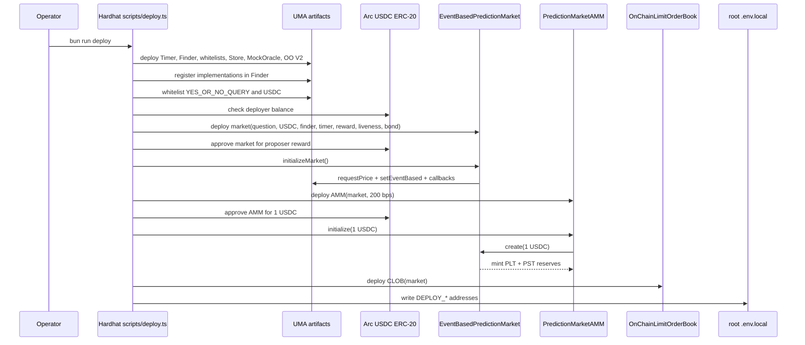
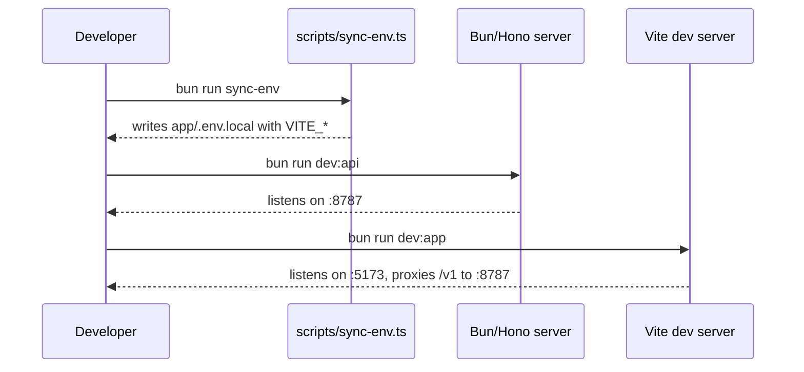
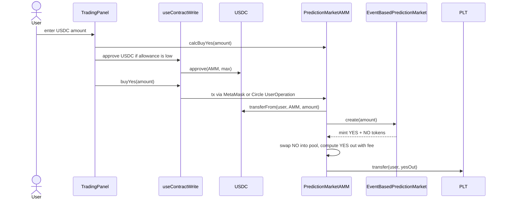
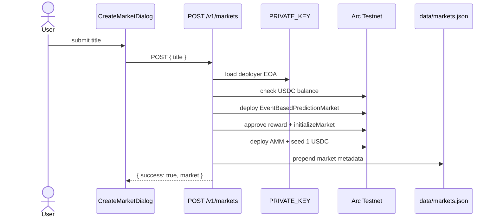
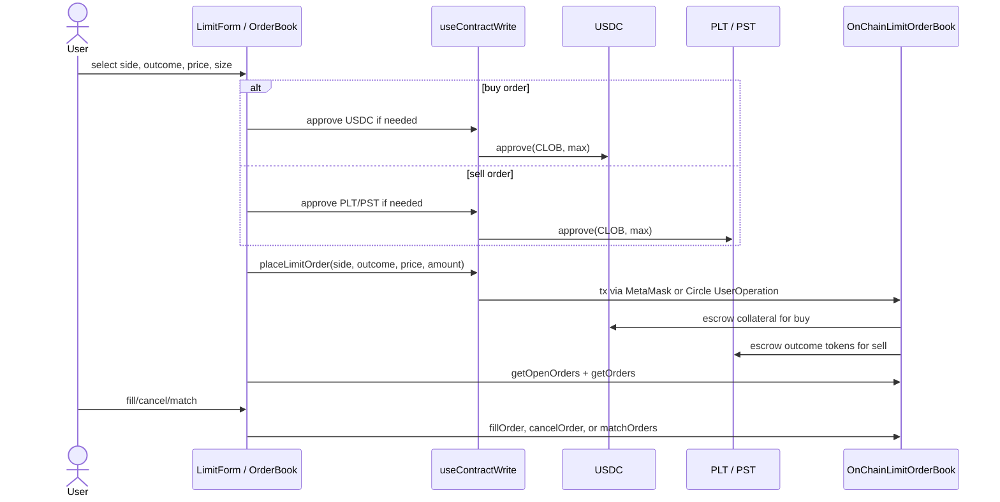
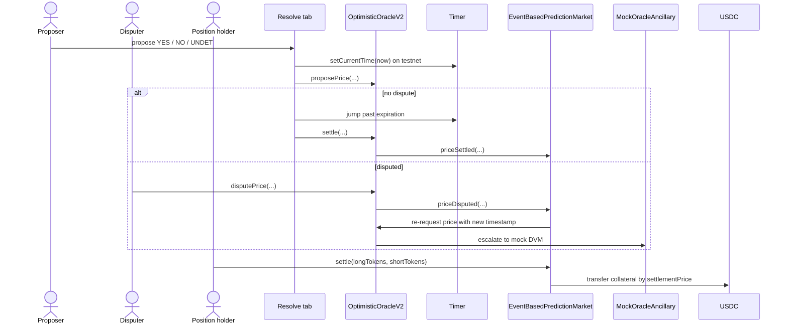

# Архітектурні діаграми

Діаграми відображають поточну реалізацію: Vite SPA, Hono API, Hardhat-deployed contracts,
USDC collateral, UMA OO V2 і escrowed on-chain CLOB limit orders.

## C4 Level 1: System Context

## C4 Level 2: Containers

## C4 Level 3: Frontend features

## Sequence: deploy base market

## Sequence: run app and API locally

## Sequence: buy YES through AMM

## Sequence: create custom market

## Sequence: on-chain CLOB limit order

## Sequence: resolve and redeem

