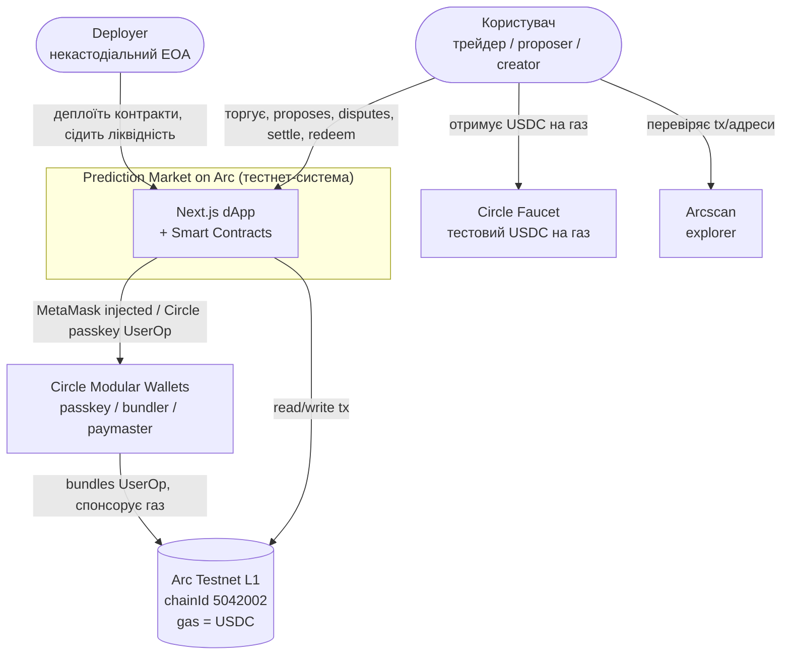
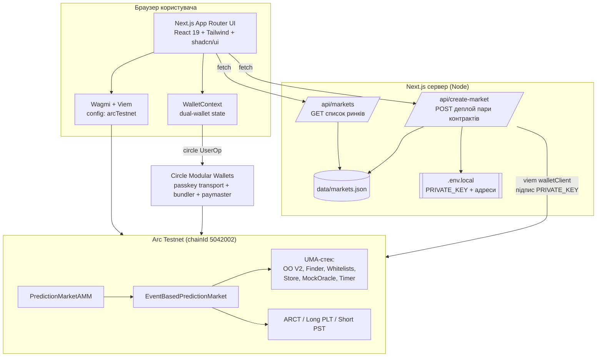
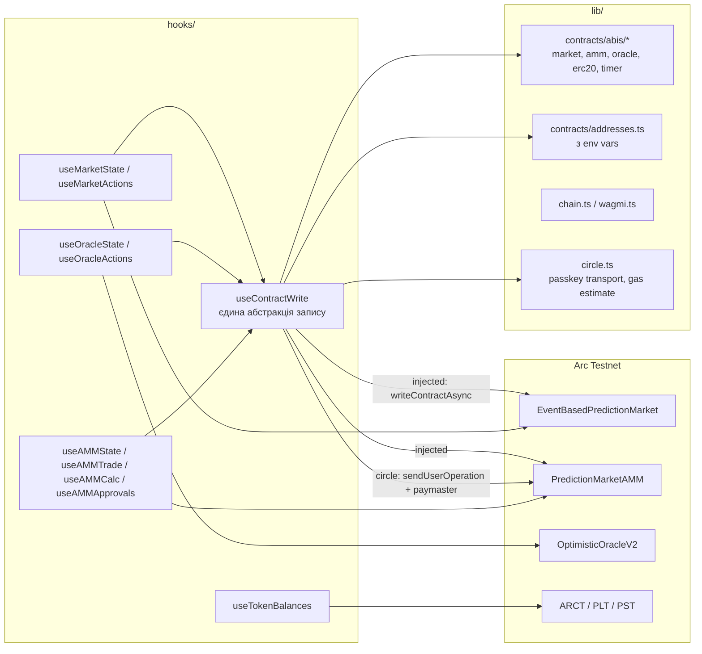
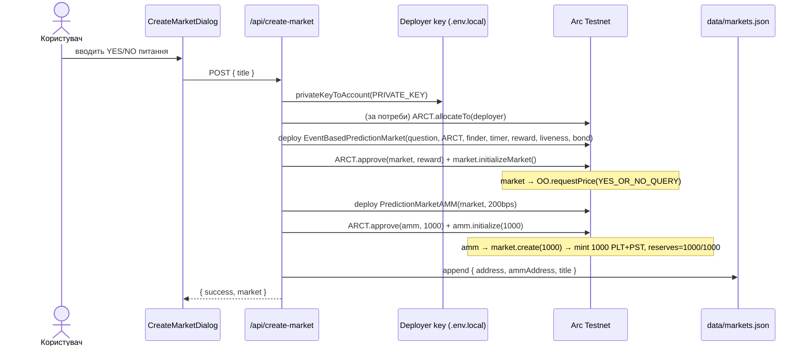
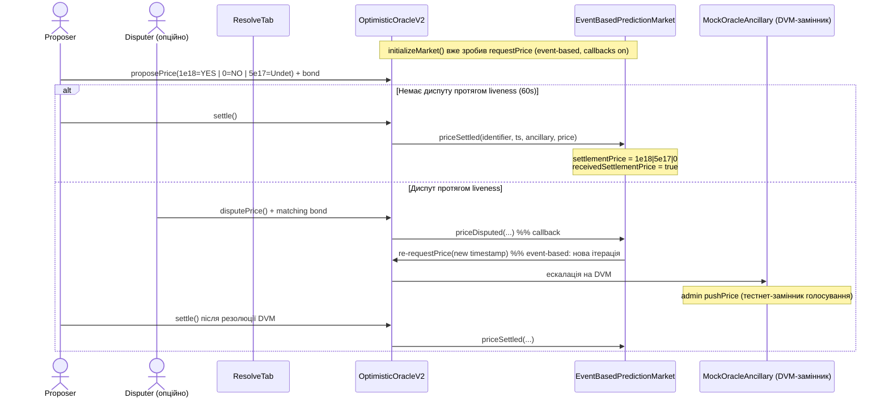
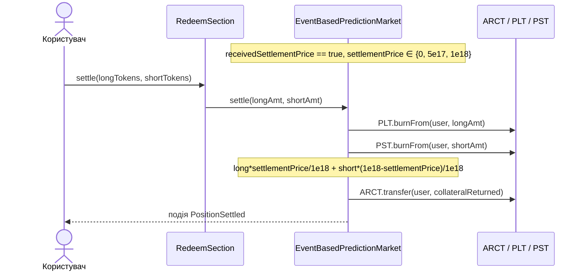

# Архітектурна діаграма — Prediction Market на Arc Testnet

Документ містить **C4-діаграми** (Context → Container → Component) і **потоки даних** для чотирьох
сценаріїв: *create market*, *trade*, *resolve*, *redeem*. Усі діаграми — у Mermaid (рендеряться на
GitHub та у VS Code з відповідним розширенням).

> Легенда меж довіри (trust boundaries) і деталі функцій — у [smart-contract-map.md](smart-contract-map.md).

---

## 1. C4 Level 1 — System Context



---

## 2. C4 Level 2 — Containers



---

## 3. C4 Level 3 — Components (frontend hooks ↔ контракти)



`useContractWrite` — ключова точка абстракції: для `walletType === "circle"` формує **UserOperation**
через bundler з `paymaster: true` (газ спонсорується), інакше — звичайний `writeContractAsync` (MetaMask/injected).

---

## 4. Потоки даних (sequence)

### 4.1 Create market (server-side деплой кастомного ринку)



### 4.2 Trade — Buy YES через AMM

```mermaid
sequenceDiagram
    actor U as Користувач
    participant UI as BuyTab
    participant H as useAMMTrade / useContractWrite
    participant AMM as PredictionMarketAMM
    participant MKT as EventBasedPredictionMarket
    participant T as ARCT / PLT / PST

    U->>UI: вводить суму USDC(ARCT), бачить calcBuyYes preview
    UI->>H: approve ARCT → AMM (за потреби)
    UI->>H: buyYes(amount)
    H->>AMM: tx (injected) або UserOp (circle + paymaster)
    AMM->>T: ARCT.transferFrom(user, amm, amount)
    AMM->>MKT: create(amount)  %% mint amount PLT + amount PST до AMM
    MKT->>T: mint PLT, PST → AMM
    Note over AMM: swap No→Yes за x*y=k, fee 2%<br/>reserveYes -= swapYesOut; reserveNo += amount
    AMM->>T: PLT.transfer(user, amount + swapYesOut)
    AMM-->>U: подія BuyYes(user, amount, yesOut)
```

### 4.3 Resolve — Propose → (Dispute) → Settle через UMA OO V2



### 4.4 Redeem — отримання колатералю після резолюції



> Альтернатива до резолюції: `redeem(n)` спалює рівну пару PLT+PST і повертає `n` ARCT 1:1.

---

## 5. Збірна компонентна схема (frontend ↔ контракти ↔ UMA ↔ AMM ↔ гаманці)

```mermaid
graph TB
    subgraph FE["Frontend (Next.js)"]
        PAGES[page.tsx / market/address/page.tsx]
        TRADE[TradingPanel: Buy/Sell/Resolve]
        ACT[MarketActions: Approve/Create/Redeem/Settle]
        WALLET[ConnectDialog: MetaMask | Circle Passkey]
        HOOKS[hooks: market / amm / oracle]
        UCW[useContractWrite]
    end

    subgraph WAL["Гаманці"]
        MM[MetaMask injected EOA]
        CP[Circle Passkey smart account<br/>+ bundler + paymaster]
    end

    subgraph CORE["Контракти ринку"]
        AMM[PredictionMarketAMM<br/>x*y=k, 2% fee]
        MKT[EventBasedPredictionMarket<br/>lifecycle + OO callbacks]
        PLT[Long PLT]
        PST[Short PST]
        ARCT[ARCT collateral]
    end

    subgraph UMAINF["UMA-інфраструктура"]
        OO[OptimisticOracleV2]
        FIND[Finder]
        IDW[IdentifierWhitelist]
        ADW[AddressWhitelist]
        STORE[Store fees=0]
        MOCK[MockOracleAncillary DVM]
        TIMER[Timer]
    end

    PAGES --> TRADE --> HOOKS
    PAGES --> ACT --> HOOKS
    WALLET --> UCW
    HOOKS --> UCW
    UCW --> MM
    UCW --> CP
    MM --> AMM
    MM --> MKT
    MM --> OO
    CP --> AMM
    CP --> MKT
    AMM --> MKT
    MKT --> PLT
    MKT --> PST
    MKT --> ARCT
    MKT --> OO
    OO --> FIND
    FIND --> IDW
    FIND --> ADW
    FIND --> STORE
    FIND --> MOCK
    OO --> MOCK
    MKT --> TIMER
```

---

## 6. Як рендерити

- **GitHub** рендерить Mermaid у `.md` автоматично.
- **VS Code:** розширення *Markdown Preview Mermaid Support*.
- **Експорт у PNG/SVG:** [mermaid.live](https://mermaid.live) або `@mermaid-js/mermaid-cli`
  (`npx -p @mermaid-js/mermaid-cli mmdc -i architecture-diagram.md -o out.svg`).
</content>
