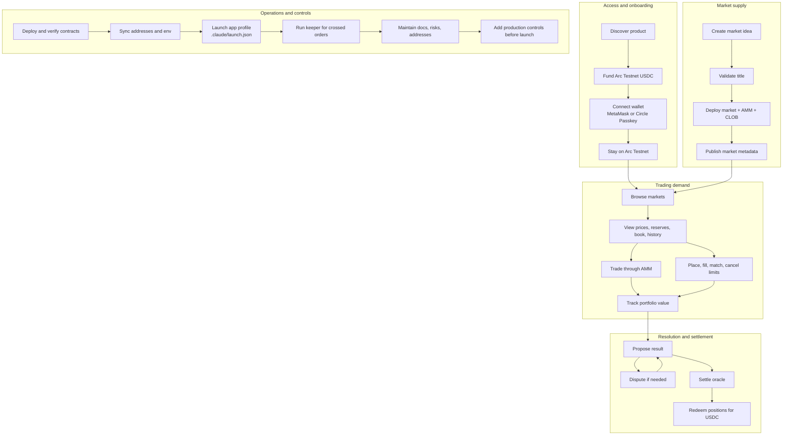
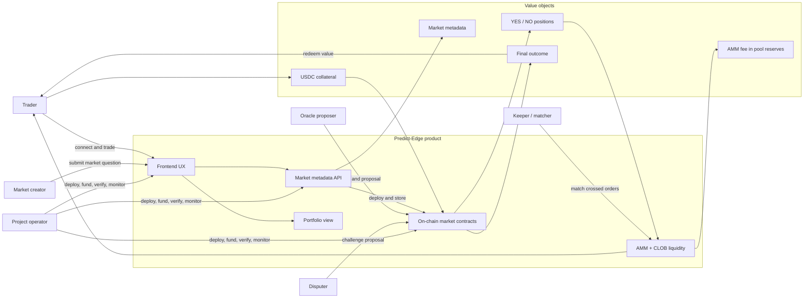
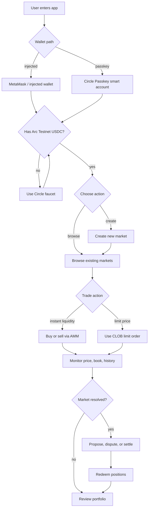
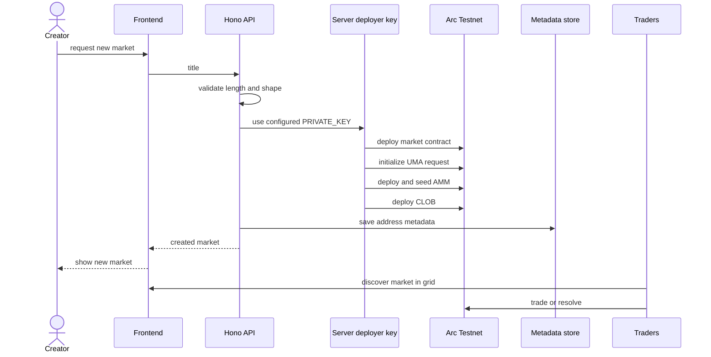
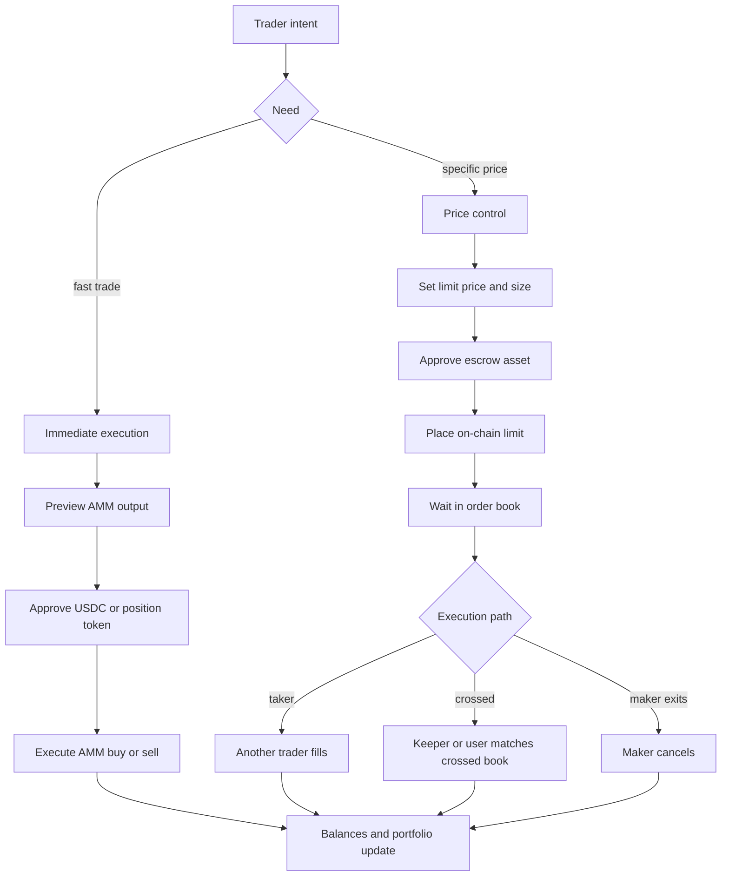
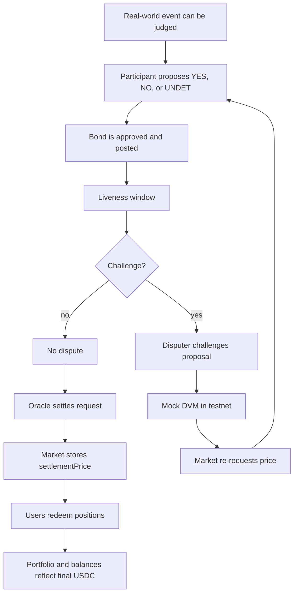
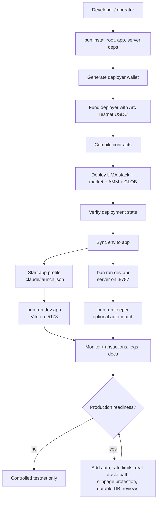

# Predict-Edge Business Processes - Mermaid ASCII

All diagram labels in this file are ASCII-only.

## Business Capability Map

## Stakeholder And Value Flow

## Core User Journey

## Market Supply Business Process

## Trading And Liquidity Business Process

## Resolution Business Process

## Operations Process

## Control And Risk Process

```mermaid
flowchart LR
    Risk["Risk found"]
    Classify["Classify impact<br/>funds, oracle, key, UX, data"]
    CurrentControl["Current testnet control"]
    Gap["Production gap"]
    Owner["Assign owner"]
    Fix["Implement mitigation"]
    Verify["Test and verify"]
    Document["Update docs and roadmap"]
    Release["Release or keep gated"]

    Risk --> Classify
    Classify --> CurrentControl
    CurrentControl --> Gap
    Gap --> Owner
    Owner --> Fix
    Fix --> Verify
    Verify --> Document
    Document --> Release
```

