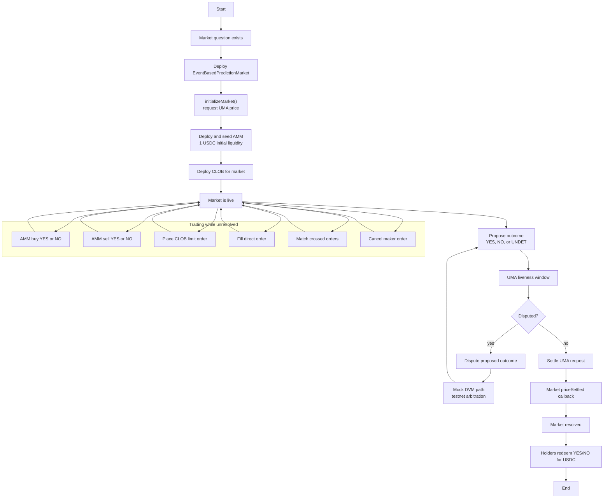
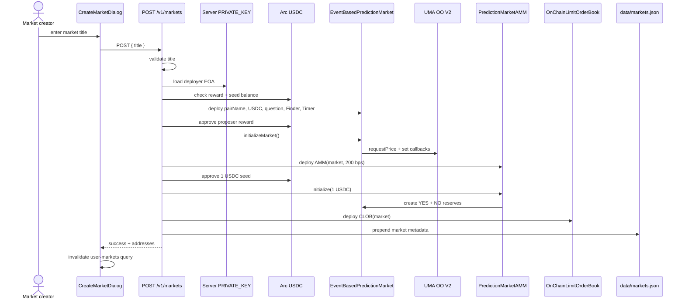
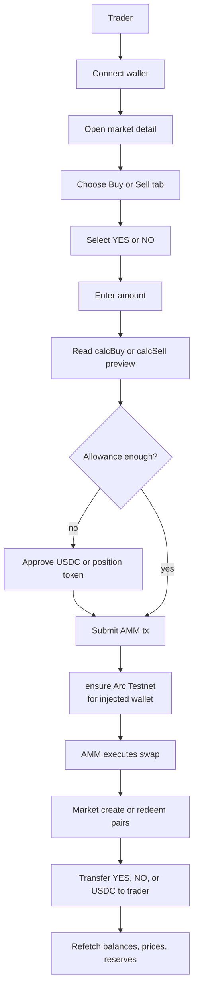
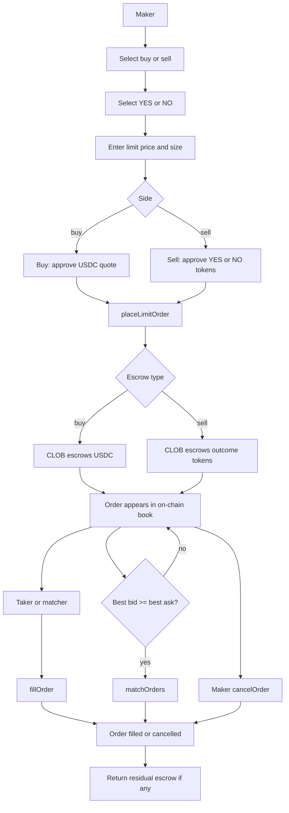
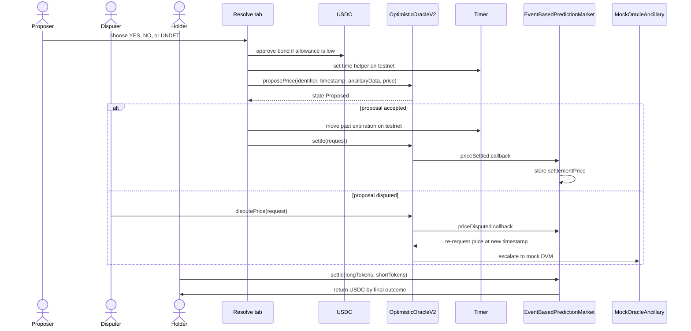
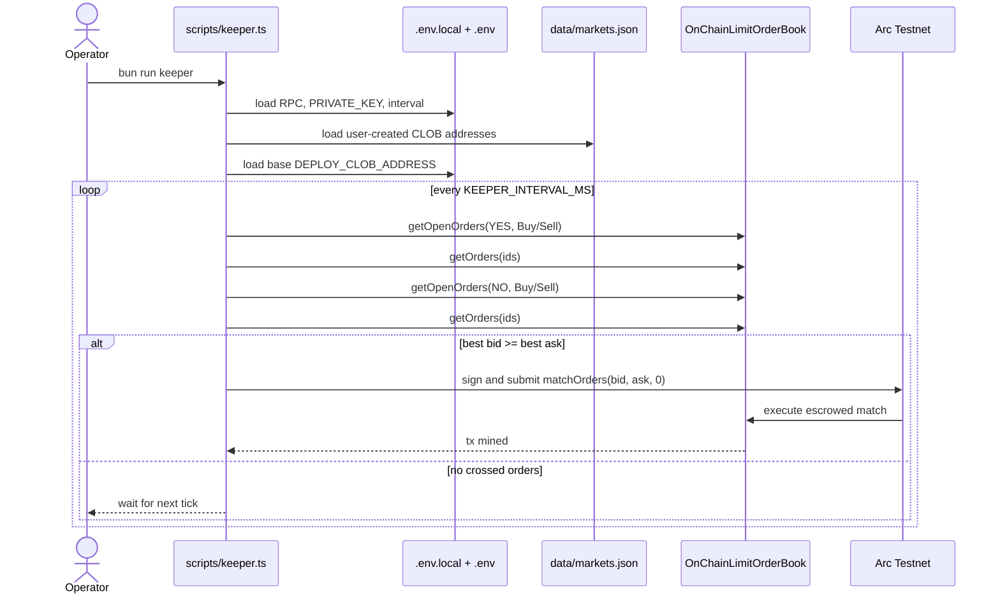
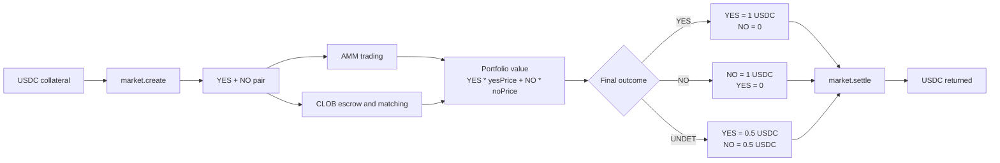

# Prediction Market Process Flow - Mermaid ASCII

All diagram labels in this file are ASCII-only.

## End-To-End Market Lifecycle

## Market Creation Flow

## AMM Buy And Sell Flow

## CLOB Limit Order Flow

## Oracle Resolution And Redeem Flow

## Keeper Auto-Match Flow

## Position Value Flow

