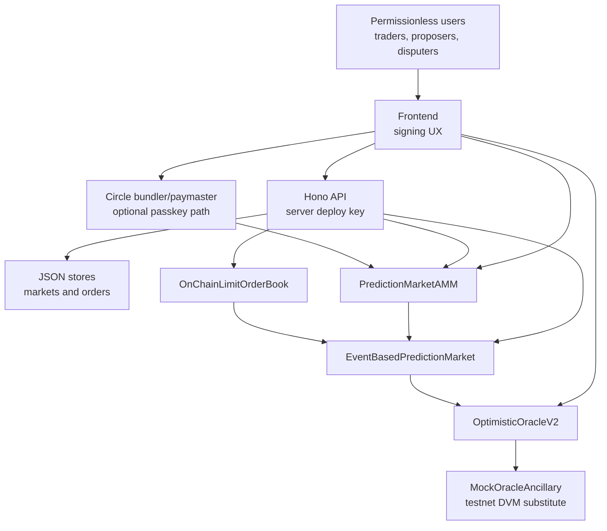

# Карта смартконтрактів

Поточний on-chain шар складається з трьох власних контрактів і UMA-інфраструктури, яку deploy script
піднімає на Arc Testnet. Торговий колатераль - Arc USDC ERC-20 system contract.

## Контракти і ролі

| Контракт | Джерело | Роль |
|---|---|---|
| `EventBasedPredictionMarket` | `contracts/EventBasedPredictionMarket.sol` | Lifecycle market, position token mint/burn, UMA callbacks, settlement |
| `PredictionMarketAMM` | `contracts/PredictionMarketAMM.sol` | Constant-product trading YES/NO positions |
| `OnChainLimitOrderBook` | `contracts/OnChainLimitOrderBook.sol` | Escrowed CLOB limit orders for one market |
| `OptimisticOracleV2` | UMA artifact from `@uma/core` | Optimistic propose/dispute/settle |
| `Finder` | UMA artifact | Registry for UMA interfaces |
| `IdentifierWhitelist` | UMA artifact | Whitelists `YES_OR_NO_QUERY` |
| `AddressWhitelist` | UMA artifact | Whitelists USDC collateral |
| `Store` | UMA artifact | Oracle fee store, configured with zero fees in this testnet deploy |
| `MockOracleAncillary` | UMA artifact | Testnet DVM substitute for disputed requests |
| `Timer` | UMA artifact | Testable time source used by market and UI resolution helpers |
| USDC ERC-20 | Arc system contract | Collateral token at `0x3600000000000000000000000000000000000000`, 6 decimals |
| `ExpandedERC20` PLT/PST | Created by market constructor | YES and NO position tokens |

The two local contracts are `AGPL-3.0-only`. Deploy scripts and application code keep the repository Apache-2.0 lineage from the Circle sample where applicable.

## `EventBasedPredictionMarket`

Responsibilities:

- Accept USDC collateral and mint equal pairs of long/short position tokens.
- Request resolution from UMA Optimistic Oracle V2.
- Process `priceDisputed` and `priceSettled` callbacks.
- Let users redeem equal pairs pre-settlement or settle positions post-resolution.

Key state:

| State | Meaning |
|---|---|
| `priceRequested` | Market has called `requestPrice` on OO V2 |
| `receivedSettlementPrice` | Final settlement price has been accepted |
| `requestTimestamp` | Current active request timestamp |
| `pairName` | Token pair label such as `BTC100K` |
| `settlementPrice` | `1e18`, `0`, or `5e17` |
| `priceIdentifier` | `YES_OR_NO_QUERY` |
| `collateralToken` | USDC ERC-20 system contract |
| `longToken`, `shortToken` | PLT/PST position tokens |
| `finder` | UMA Finder |
| `customAncillaryData` | UTF-8 market question bytes |
| `proposerReward`, `optimisticOracleLivenessTime`, `optimisticOracleProposerBond` | OO parameters |

Key functions:

| Function | Access | Behavior |
|---|---|---|
| `constructor(...)` | deploy | Verifies identifier and collateral whitelist, creates PLT/PST, assigns market as minter/burner |
| `initializeMarket()` | public | Pulls proposer reward from caller, requests price from OO V2, one-time only |
| `create(tokensToCreate)` | public after init | Pulls USDC 1:1 and mints equal PLT/PST |
| `redeem(tokensToRedeem)` | public | Burns equal PLT/PST and returns USDC 1:1 |
| `settle(longTokens, shortTokens)` | public after resolution | Burns positions and returns USDC based on `settlementPrice` |
| `priceSettled(...)` | OO only | Validates callback and stores final settlement price |
| `priceDisputed(...)` | OO only | Validates callback, moves timestamp, re-requests price |
| `getOptimisticOracle()` | view | Resolves OO V2 through Finder |

Events:

- `TokensCreated`
- `TokensRedeemed`
- `PositionSettled`
- `MarketInitialized`
- `PriceDisputed`

Resolution mapping:

| OO price | YES token value | NO token value |
|---|---|---|
| `1e18` | 1 USDC | 0 |
| `0` | 0 | 1 USDC |
| `5e17` | 0.5 USDC | 0.5 USDC |

## UMA integration

`_requestOraclePrice()` performs:

1. `collateralToken.safeApprove(OO, proposerReward)`.
2. `requestPrice(YES_OR_NO_QUERY, requestTimestamp, customAncillaryData, USDC, proposerReward)`.
3. `setCustomLiveness(..., optimisticOracleLivenessTime)`.
4. `setBond(..., optimisticOracleProposerBond)`.
5. `setEventBased(...)`.
6. `setCallbacks(false, true, true)` so only dispute and settle callbacks are enabled.

Callback safety:

- `msg.sender` must be the current OO V2 address resolved from Finder.
- `identifier` must equal `YES_OR_NO_QUERY`.
- `ancillaryData` hash must match the market question.
- `priceSettled` ignores stale timestamps.
- `priceDisputed` requires the current timestamp and matching refund.

## `PredictionMarketAMM`

Responsibilities:

- Seed equal YES/NO reserves.
- Buy/sell YES and NO through constant-product math.
- Preview output amounts for UI.
- Block trading after market resolution.

Key state:

| State | Meaning |
|---|---|
| `market` | Linked `EventBasedPredictionMarket` |
| `collateralToken` | USDC |
| `longToken`, `shortToken` | PLT/PST |
| `reserveYes`, `reserveNo` | AMM reserves in position token units |
| `feeBps` | `200` in current deploy |
| `initialized` | AMM seeded flag |

Key functions:

| Function | Behavior |
|---|---|
| `constructor(market, feeBps)` | Binds market/tokens and validates fee `< 10000` |
| `initialize(initialLiquidity)` | Pulls USDC, calls `market.create`, seeds equal reserves |
| `buyYes(usdcAmount)` | Pulls USDC, mints pair, swaps NO into pool, sends YES |
| `buyNo(usdcAmount)` | Pulls USDC, mints pair, swaps YES into pool, sends NO |
| `sellYes(yesAmount)` | Pulls YES, swaps to NO, redeems pairs, returns USDC |
| `sellNo(noAmount)` | Pulls NO, swaps to YES, redeems pairs, returns USDC |
| `getYesPrice()` | `reserveNo * 1e18 / (reserveYes + reserveNo)` |
| `getNoPrice()` | `reserveYes * 1e18 / (reserveYes + reserveNo)` |
| `getReserves()` | Returns `(reserveYes, reserveNo)` |
| `calcBuyYes/No`, `calcSellYes/No` | View previews for frontend |

Events:

- `BuyYes`
- `BuyNo`
- `SellYes`
- `SellNo`

Security notes:

- All trade functions are `nonReentrant`.
- `whenActive` requires `initialized` and blocks trading after settlement.
- Contract uses `SafeERC20`.
- AMM grants max approvals to the market for USDC/PLT/PST. This is convenient but should be reviewed before production.
- There is no `minOut` or deadline argument, so users rely on UI preview only.

## Deploy-time UMA bootstrap

```text
Finder
├── IdentifierWhitelist -> supports YES_OR_NO_QUERY
├── CollateralWhitelist -> supports USDC system address
├── Store -> zero oracle fees for testnet
├── Oracle -> MockOracleAncillary
└── OptimisticOracleV2 -> deployed OO V2
```

Deploy script phases:

1. Deploy Timer, Finder, IdentifierWhitelist, AddressWhitelist, Store, MockOracleAncillary, OptimisticOracleV2.
2. Register implementations in Finder.
3. Whitelist `YES_OR_NO_QUERY`.
4. Whitelist USDC collateral.
5. Check deployer USDC balance.
6. Deploy `EventBasedPredictionMarket`.
7. Approve proposer reward and call `initializeMarket`.
8. Deploy `PredictionMarketAMM`.
9. Approve seed liquidity and call `initialize`.
10. Deploy `OnChainLimitOrderBook`.
11. Write addresses into root `.env.local`, including `DEPLOY_CLOB_ADDRESS`.

## `OnChainLimitOrderBook`

Responsibilities:

- Store and escrow limit orders per market.
- Escrow USDC for buy orders.
- Escrow PLT/PST for sell orders.
- Let makers cancel open orders.
- Let takers fill resting orders directly.
- Let any matcher match crossed buy/sell orders.

Key types:

| Type | Values |
|---|---|
| `Side` | `Buy`, `Sell` |
| `Outcome` | `Yes`, `No` |
| `Status` | `Open`, `Filled`, `Cancelled` |

Key state:

| State | Meaning |
|---|---|
| `PRICE_SCALE` | `1e18`, price fixed-point scale |
| `market` | The linked prediction market |
| `collateralToken` | USDC |
| `longToken`, `shortToken` | YES/NO tokens |
| `nextOrderId` | Incrementing order id |
| `orders` | Order storage by id |
| `openOrderIds` | Private book index by `(outcome, side)` |

Key functions:

| Function | Behavior |
|---|---|
| `placeLimitOrder(side, outcome, price, amount)` | Escrows USDC or outcome tokens and opens an order |
| `cancelOrder(orderId)` | Maker-only cancel and escrow return |
| `fillOrder(orderId, amountToFill)` | Taker fills a resting order; `0` means full remaining amount |
| `matchOrders(buyOrderId, sellOrderId, amountToFill)` | Matches crossed orders using seller ask price |
| `getOpenOrders(outcome, side)` | Returns open order IDs for one book side |
| `getOrders(ids)` | Returns order structs for UI |

Events:

- `OrderPlaced`
- `OrderCancelled`
- `OrderFilled`
- `OrdersMatched`

Security notes:

- `nonReentrant` protects state-changing order functions.
- `whenActive` blocks place/fill/match after market settlement.
- Escrow is held by the CLOB contract and returned on cancel/final residual.
- Limit orders are regular on-chain transactions with escrow in `OnChainLimitOrderBook`.
- Matching uses seller price, so keeper/matcher policy should be documented before production.

## Trust boundaries



| Boundary | Trusted component | Risk |
|---|---|---|
| User -> contracts | Contract code only | Bounded by Solidity logic and ERC-20 approvals |
| OO -> market callbacks | Current OO address from Finder | Callback forgery blocked by sender and data checks |
| OO dispute path | `MockOracleAncillary` admin | Testnet admin can decide disputed outcomes |
| Frontend -> API create market | Server `PRIVATE_KEY` | Public endpoint can spend deployer USDC/gas if unprotected |
| CLOB | On-chain escrow contract | More contract surface, gas, and keeper/matching requirements |
| Legacy orders API | JSON file store | Not the current UI path; not durable or production-grade |
| Circle path | Circle infra | Passkey tx unavailable if bundler/paymaster fails |

## Off-chain components

- `data/markets.json` stores user-created market metadata.
- Current `TradingPanel` and `OrderBook` use `OnChainLimitOrderBook`.
- `OrderBook` also derives AMM depth from reserves as reference liquidity.
- `TradeHistory` reads AMM and CLOB logs from Arc.
