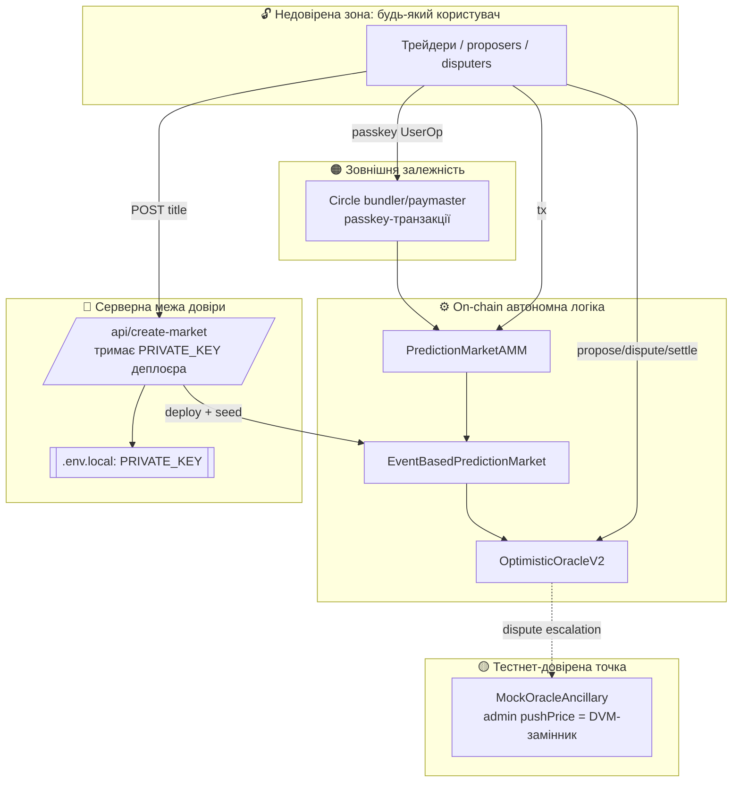

# Карта смартконтрактів

Огляд усіх контрактів системи: відповідальність, ключові функції, події, точки інтеграції з
**UMA Optimistic Oracle V2** і **межі довіри (trust boundaries)**.

| Контракт | Джерело | Ліцензія | Роль |
|---|---|---|---|
| `EventBasedPredictionMarket` | `contracts/` (власний) | AGPL-3.0-only | Життєвий цикл ринку, інтеграція з OO |
| `PredictionMarketAMM` | `contracts/` (власний) | AGPL-3.0-only | Constant-product торгівля позиціями |
| `OptimisticOracleV2` | `@uma/core` | — | Optimistic-оракул: request→propose→dispute→settle |
| `Finder` | `@uma/core` | — | Реєстр адрес UMA-екосистеми |
| `IdentifierWhitelist` | `@uma/core` | — | Whitelist цінових ідентифікаторів |
| `AddressWhitelist` | `@uma/core` | — | Whitelist дозволених колатералей |
| `Store` | `@uma/core` | — | Комісії оракула (на тестнеті = 0) |
| `MockOracleAncillary` | `@uma/core` | — | DVM-замінник на тестнеті (admin push price) |
| `Timer` | `@uma/core` | — | Керований час для тестів |
| `TestnetERC20` (ARCT) | `@uma/core` | — | Вільно мінтований колатераль (18 dec) |
| `ExpandedERC20` (PLT/PST) | `@uma/core` | — | Long/Short позиційні токени (mint/burn) |

---

## 1. `EventBasedPredictionMarket.sol`

**Відповідальність:** ядро ринку — мінт/спалення пар Long(YES)/Short(NO), запит ціни в OO,
обробка callback-ів оракула, фінальна резолюція та погашення.

Успадковує `Testable` (UMA) → джерело часу через `Timer`.

### Ключові функції

| Функція | Доступ | Призначення |
|---|---|---|
| `constructor(pairName, collateral, ancillaryData, finder, timer, reward, liveness, bond)` | deploy | Перевіряє whitelist ідентифікатора й колатералю; створює `longToken`/`shortToken` (PLT/PST), призначає себе minter/burner |
| `initializeMarket()` | public | Тягне `proposerReward`, викликає `_requestOraclePrice()`; **одноразово** (`!priceRequested`) |
| `create(tokensToCreate)` | public, `requestInitialized` | Депонує колатераль 1:1, мінтить рівну пару PLT+PST |
| `redeem(tokensToRedeem)` | public | Спалює рівну пару PLT+PST, повертає колатераль 1:1 (до резолюції) |
| `settle(longAmt, shortAmt)` | public | Після резолюції спалює токени, повертає `long*P + short*(1−P)` |
| `priceSettled(id, ts, ancillary, price)` | **тільки OO** | Callback: фіксує `settlementPrice` ∈ {0, 5e17, 1e18}, `receivedSettlementPrice=true` |
| `priceDisputed(id, ts, ancillary, refund)` | **тільки OO** | Callback: re-request ціни з новим timestamp (event-based) |
| `getOptimisticOracle()` | view | Резолвить OO V2 через `Finder` |

### Події
`TokensCreated`, `TokensRedeemed`, `PositionSettled`, `MarketInitialized`, `PriceDisputed`.

### Інтеграція з UMA OO V2 (`_requestOraclePrice`)
1. `approve(OO, proposerReward)` колатералю.
2. `requestPrice(YES_OR_NO_QUERY, ts, ancillaryData, collateral, reward)`.
3. `setCustomLiveness(...)` — 60s на тестнеті.
4. `setBond(...)` — proposerBond (100 ARCT).
5. `setEventBased(...)` — DVM голосує за timestamp пропозиції; дозволяє кілька раундів диспутів.
6. `setCallbacks(false, true, true)` — увімкнено `priceDisputed` і `priceSettled` (НЕ `priceProposed`).

### Карта значень резолюції
| `settlementPrice` | Long(YES) | Short(NO) |
|---|---|---|
| `1e18` (YES) | 1 ARCT/токен | 0 |
| `0` (NO) | 0 | 1 ARCT/токен |
| `5e17` (Undetermined) | 0.5 | 0.5 |

---

## 2. `PredictionMarketAMM.sol`

**Відповідальність:** безперервна торгівля YES/NO за constant-product `x*y=k` поверх ринку.
Успадковує `ReentrancyGuard`; усі торгові методи — `nonReentrant whenActive`.

### Ключові функції

| Функція | Призначення |
|---|---|
| `constructor(market, feeBps)` | Біндить ринок, токени; `feeBps < 10000` |
| `initialize(liquidity)` | Тягне колатераль, `market.create(liquidity)`, approve PLT/PST ринку, сід `reserveYes=reserveNo=liquidity` |
| `buyYes(usdcAmount)` | Тягне ARCT → `create()` → swap No→Yes (fee) → віддає `amount + swapYesOut` PLT |
| `buyNo(usdcAmount)` | Симетрично для NO |
| `sellYes(yesAmount)` | Тягне PLT → swap Yes→No → `market.redeem(noOut)` → віддає ARCT |
| `sellNo(noAmount)` | Симетрично для NO |
| `getYesPrice()` | `reserveNo*1e18/(reserveYes+reserveNo)` (читається як ймовірність) |
| `getNoPrice()` | `reserveYes*1e18/(reserveYes+reserveNo)` |
| `getReserves()` | `(reserveYes, reserveNo)` |
| `calcBuyYes/No`, `calcSellYes/No` | Прев'ю-розрахунки без зміни стану |

### Події
`BuyYes`, `BuyNo`, `SellYes`, `SellNo`.

### Інваріанти / зауваги
- Ціни YES+NO ≈ 1.00 (за конструкцією); fee 2% «з'їдає» вихід (`effectiveAmount`).
- `whenActive` блокує торгівлю після `receivedSettlementPrice` (ринок резолвнуто).
- AMM тримає `approve(market, max)` на колатераль і PLT/PST — для `create`/`redeem`.
- Купівля = mint пари + swap небажаної ноги → ефективна ціна нелінійна за обсягом.

---

## 3. UMA-стек (`@uma/core`, деплоїться скриптом)

```
Finder (реєстр)
 ├─ IdentifierWhitelist  → addSupportedIdentifier("YES_OR_NO_QUERY")
 ├─ CollateralWhitelist (AddressWhitelist) → addToWhitelist(ARCT)
 ├─ Store (fees = 0)
 ├─ Oracle → MockOracleAncillary (DVM-замінник)
 └─ OptimisticOracleV2 (defaultLiveness 7200, finder, timer)
```

- **`OptimisticOracleV2`** — приймає `requestPrice/proposePrice/disputePrice/settle`; на settle
  викликає `priceSettled` ринку; на dispute — `priceDisputed` і ескалує до `Oracle` (Mock).
- **`MockOracleAncillary`** — на тестнеті заміняє реальний DVM: admin може `pushPrice`,
  імітуючи результат голосування.
- **`Timer`** — `Testable`-час; у production передається `0x0` (системний час).
- **`TestnetERC20` (ARCT)** — `allocateTo(addr, amount)` вільно мінтить (faucet UI).

---

## 4. Межі довіри (Trust Boundaries)



| # | Межа | Хто «всередині» | Ризик при компрометації |
|---|---|---|---|
| TB1→TB2 | Користувач → контракти | будь-хто (permissionless) | обмежений логікою контрактів; reentrancy-guard на AMM |
| TB2 (callbacks) | OO → ринок | **тільки** адреса OO (`require msg.sender == OO`) | підробка callback неможлива поза OO |
| TB3 | Mock DVM | **admin Mock-оракула** | може встановити будь-який результат диспуту (тестнет!) |
| TB4 | `/api/create-market` | **сервер із PRIVATE_KEY** | злив ключа → втрата контролю над деплоєром; немає auth/rate-limit |
| TB5 | Circle bundler/paymaster | **Circle-інфраструктура** | відмова сервісу → passkey-tx недоступні; paymaster спонсорує газ |

**Висновок:** автономна частина (AMM ↔ market ↔ OO) недовірена й permissionless; основні «довірені»
точки — це **Mock DVM (admin)** і **серверний ключ деплоєра** у create-market. Обидва — свідомі
тестнет-спрощення (деталі мітигацій у [risks-and-security.md](risks-and-security.md)).
</content>
